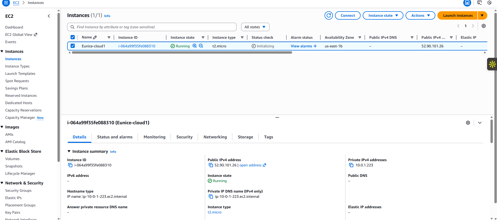
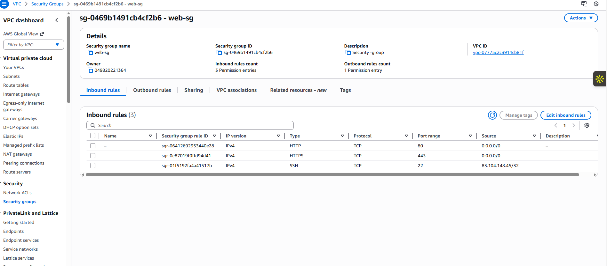
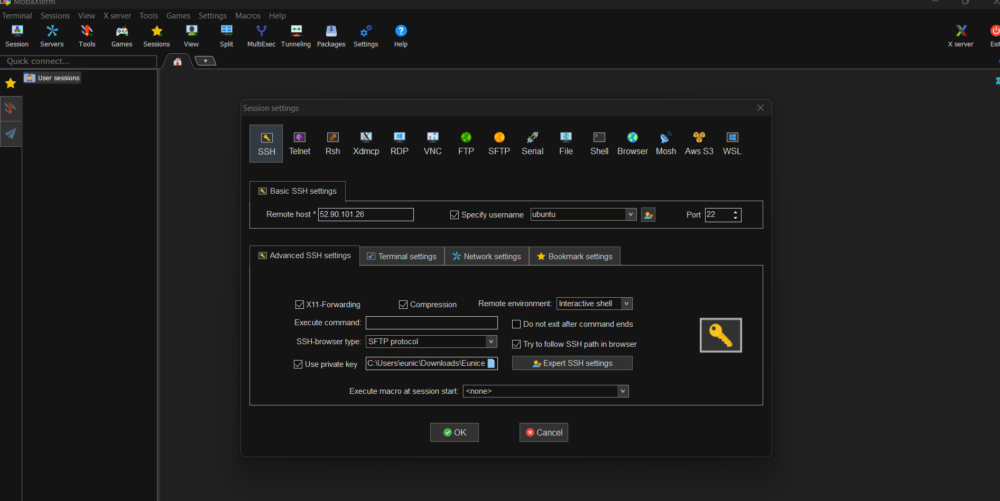
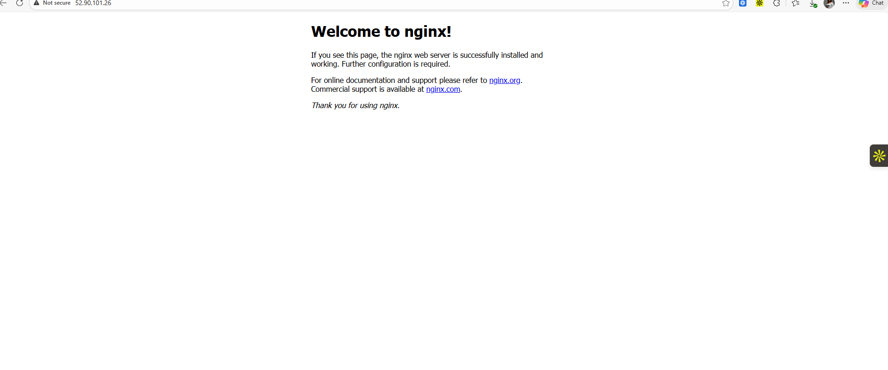

# Project 03 – EC2 Web Deployment

## Project Objectives
- Launch an EC2 instance in the Project 02 VPC  
- Configure security groups and network access  
- Access the instance via SSH using MobaXterm  
- Deploy a web application from GitHub  
- Map a custom domain name from Namecheap  

---

## Tools Required
- AWS Account  
- EC2 Instance  
- Security Groups  
- Key Pair (SSH)  
- MobaXterm (for SSH access)  
- Ubuntu Server  
- GitHub repository for website content  
- Namecheap domain and DNS  

---

## Step-by-Step Implementation

### Phase I: Launch EC2 Instance

1. Navigate to **EC2** in AWS and click **Launch Instance**  
2. Select **Ubuntu Server**  
3. Create a new **Key Pair** (SSH) and download the `.pem` file  
4. Select the **VPC** and **public subnet** created in Project 02  
5. Assign the previously configured **security group**  
6. Enable **Auto-assign Public IP**  

**Review:** EC2 instance is launched in a secure VPC.

---

### Phase II: Key Pair & Security Group
  

- Key Pair allows secure SSH login  
- Security Group allows HTTP (80) and SSH (22) traffic  
- Outbound traffic is open to the internet  

---

### Phase III: SSH Access via MobaXterm

1. Open **MobaXterm**, start a new SSH session  
2. Enter the EC2 **public IP** and username `ubuntu`  
3. Import the downloaded **key pair**  
4. Connect to the instance  

**Review:** Terminal access to the Ubuntu server achieved.

---

### Phase IV: Install & Verify Nginx

sudo apt update
sudo apt upgrade -y
sudo apt install nginx -y
sudo systemctl status nginx
Check the web server by navigating to the public IP in a browser.

---

### Phase V: Deploy Website from GitHub
git clone https://github.com/digitalwitchdemo/mediplus.git
cd mediplus
sudo mv ./* /var/www/html

Website content now served from Nginx

Phase VI: Domain Name Configuration

Use your Namecheap domain (eunicecloud9.online)

Add an A Record pointing to EC2 public IP

Optional: Add CNAME for subdomains

Verify DNS propagation using a DNS checker

Open website via your custom domain

Review: Domain successfully mapped to the EC2 server.

Key Concepts Demonstrated

EC2 instance launch & configuration

Security Groups & SSH access

Ubuntu server administration

Web application deployment from GitHub

Domain mapping and DNS management

Outcome

A fully functional web server on AWS EC2 with content deployed from GitHub and accessible via a custom domain.

Planned Repository Structure
03-ec2-web-deployment/
├── README.md
└── images-ec2/
    ├── 01-ec2-launch.png
    ├── 02-key-pair-created.png
    ├── 03-network-security.png
    ├── 04-mobaxterm-ssh.png
    ├── 05-nginx-running.png
    ├── 06-website-live-ip.png
    ├── 07-domain-dns-record.png
    ├── 08-domain-live.png
    └── 09-website-live.png

